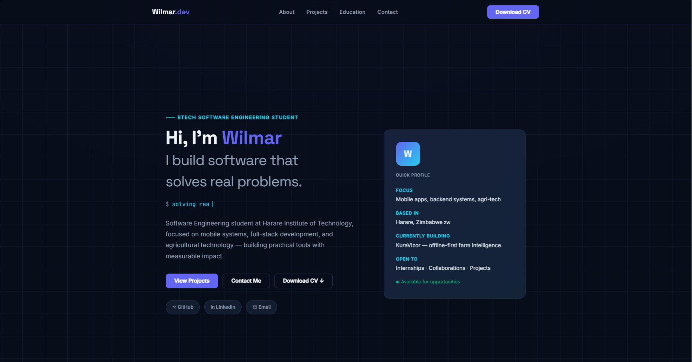

# Wilmar Macheke — Portfolio

> Personal portfolio website built with React. Showcases projects, skills, and background as a Software Engineering student at Harare Institute of Technology.

**Live site:** `[your-deployed-url]` &nbsp;·&nbsp; **Author:** [Wilmar Macheke](https://github.com/axecrow-12)

---

## Preview



---

## Tech Stack

| Layer | Technology |
|-------|-----------|
| Framework | React 18 |
| Styling | Plain CSS (custom properties, no UI library) |
| Animations | CSS transitions + IntersectionObserver |
| Fonts | Space Grotesk · Inter · JetBrains Mono |
| Motion | Framer Motion (hero section) |
| Build tool | Vite |
| Deployment | Vercel / Netlify |

---

## Features

- **Typewriter effect** — cycles through what I do, built with a custom React hook
- **Animated skill bars** — trigger on scroll via IntersectionObserver
- **Project filter** — filter projects by technology category
- **Scroll progress bar** — indigo/cyan gradient fixed to the top of the viewport
- **Scroll reveal animations** — sections fade up as they enter view
- **Live availability indicator** — pulsing dot on the profile card
- **Responsive layout** — works across mobile, tablet, and desktop
- **Reduced motion support** — respects `prefers-reduced-motion`

---

## Projects Featured

### LocationTracker
Android application for GPS tracking, geofencing, push notifications, and Google Maps navigation. Implements real-time location updates with background service support.
`Java` `Android` `Room` `Google Maps API`
→ [github.com/axecrow-12/LocationTracker](https://github.com/axecrow-12/LocationTracker)

### KuraVizor *(In Progress)*
Offline-first farm intelligence platform designed for low-connectivity environments. Provides agricultural analytics, crop tracking, and decision support with full offline capability.
`TypeScript` `React` `PostgreSQL` `Prisma`
→ [github.com/axecrow-12/kuravisor](https://github.com/axecrow-12/kuravisor)

### Agrovia 2.0
Collaborative agriculture platform enabling farmer coordination, resource sharing, market access, and analytics.
`React` `Spring Boot` `MySQL`
→ [github.com/axecrow-12/Agrovia_2.0](https://github.com/axecrow-12/Agrovia_2.0)

---

## Getting Started

### Prerequisites

- Node.js 18+
- npm or yarn

### Installation

```bash
# Clone the repo
git clone https://github.com/axecrow-12/portfolio.git
cd portfolio

# Install dependencies
npm install

# Start the dev server
npm run dev
```

The site runs at `http://localhost:5173` by default.

### Build for production

```bash
npm run build
```

Output goes to `dist/`. Deploy the contents of that folder to any static host.

---

## Project Structure

```
src/
├── App.jsx          # All sections and components
├── App.css          # Design system, layout, and component styles
└── main.jsx         # React entry point

public/
└── Wilmar-CV.pdf    # CV file linked from the nav and hero
```

---

## Customisation

All content lives in `App.jsx` at the top of the file in plain arrays — no CMS, no config files. To update:

- **Projects** — edit the `projects` array
- **Skills** — edit the `skills` array (name + percentage)
- **Tech chips** — edit the `chips` array
- **Certifications** — edit the `certifications` array
- **Typewriter phrases** — edit the `phrases` array
- **CV file** — replace `public/Wilmar-CV.pdf`

Colors are defined as CSS custom properties in `:root` inside `App.css` and can be swapped in one place.

---

## Deployment

### Vercel (recommended)

```bash
npm install -g vercel
vercel
```

### Netlify

```bash
npm run build
# Drag the dist/ folder into netlify.com/drop
```

---

## Contact

- **Email:** axecrow12@gmail.com
- **GitHub:** [github.com/axecrow-12](https://github.com/axecrow-12)
- **LinkedIn:** [linkedin.com/in/wilmar-macheke-597934352](https://www.linkedin.com/in/wilmar-macheke-597934352)

---

© 2026 Wilmar Macheke
